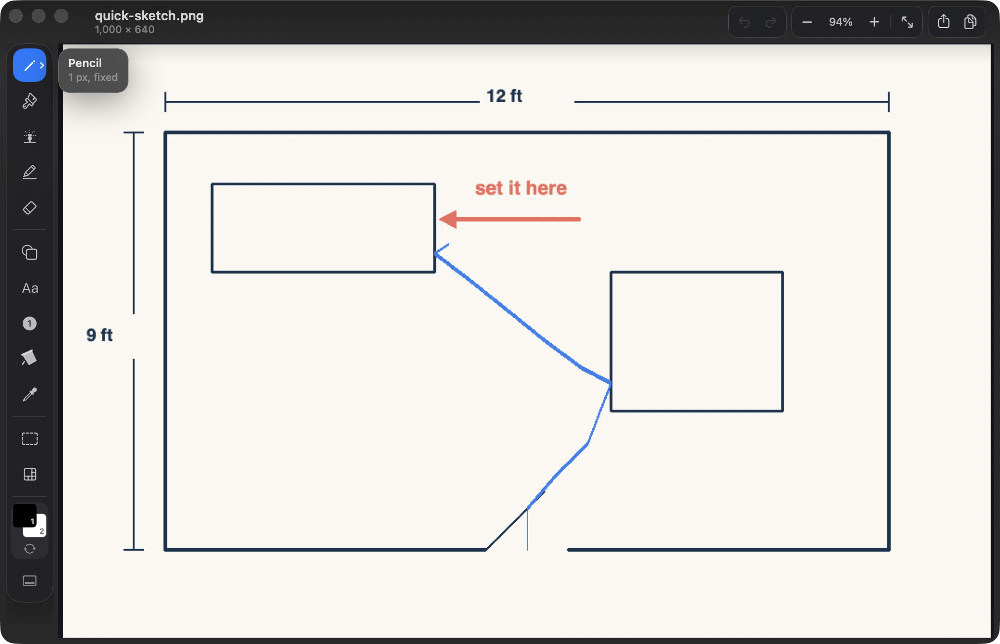
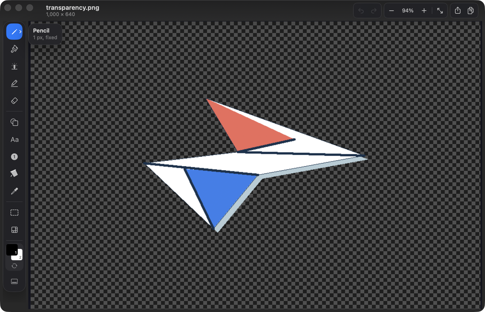

<div align="center">

# ItsPaint

### A focused paint app for macOS.

Open an image, make a quick edit, and export it without setting up a workspace.
ItsPaint keeps its drawing tools, colours, and palette visible in one native Mac
window.

[](https://github.com/joshlin2201/itspaint/actions/workflows/ci.yml)
[](https://github.com/joshlin2201/itspaint/releases)
[](https://github.com/joshlin2201/itspaint/releases)
[](https://swift.org)
[](LICENSE)

<br>


<sub>A pasted plan, highlighted and annotated in ItsPaint. Reproduce the canvas
with <code>swift run --package-path Packages/PaintKit paint-demo --scene
clipboard out.png</code>.</sub>

</div>

## Highlights

- **Twelve visible tools** for drawing, markup, text, selection, colour, and
  pixelation.
- **Fifteen shapes** with solid, dashed, or dotted outlines and optional fills.
- **A 48pt tool rail** — one cell thick on either edge — that moves between the
  left and bottom of the window.
- **Precise canvas control** with pointer-centred zoom, nearest-neighbour display
  above 100%, pixel grids, and live tool footprints.
- **Paste without losing anything** — the canvas grows to hold an image larger
  than it, and the window follows, so nothing is cropped when you place it.
- **Rotate by any angle**, with the canvas growing to fit the corners.
- **Native documents and common exports** with no third-party dependencies,
  accounts, telemetry, or cloud service.

## Quick edits, ready to send

<table>
  <tr>
    <td width="50%"></td>
    <td width="50%"></td>
  </tr>
  <tr>
    <td><strong>Sketch the idea.</strong> Draw a layout, route, or quick correction.</td>
    <td><strong>Keep transparency.</strong> Remove a plain background with Instant Alpha.</td>
  </tr>
</table>

## Install

Download the latest beta from [Releases](https://github.com/joshlin2201/itspaint/releases),
open the disk image, and drag **ItsPaint** to Applications.

Releases are signed with a Developer ID and notarised by Apple, so Gatekeeper
opens them with no extra steps — no Control-click, and nothing to clear from the
Terminal.

Each release includes `checksums.txt` with SHA-256 hashes. The notarisation
ticket is stapled to both the disk image and the app inside it, so a first
launch works offline:

```bash
shasum -a 256 -c checksums.txt
xcrun stapler validate ItsPaint-0.11.0.dmg
```

ItsPaint requires macOS 14 Sonoma or later.

To build from source:

```bash
git clone https://github.com/joshlin2201/itspaint.git
cd itspaint
open ItsPaint.xcodeproj
```

Build and run the **ItsPaint** scheme with `⌘R`. Xcode 16 or later is required.

## Tools

| Group | Tools |
|---|---|
| **Draw** | Pencil, Brush, Airbrush, Highlighter, Eraser |
| **Insert** | Shape, Text, Step Badge, Fill, Eyedropper |
| **Select** | Rectangle, Ellipse, Lasso, Instant Alpha |
| **Effects** | Pixelate |

The Shape tool includes line, curve, arrow, rectangle, rounded rectangle,
ellipse, triangle, right triangle, diamond, pentagon, hexagon, five- and
six-point stars, speech bubble, and polygon.

Instant Alpha selects connected pixels by colour. Use `⇧`-click to add to the
selection, `⌥`-click to subtract, then choose **Make transparent**.

Pixelate is intended for visual de-emphasis, not secure redaction. Use an opaque
filled shape to cover private information before exporting a flattened image.

## Everyday workflow

Paste an image with `⌘V` or open it from Finder. Add arrows, shapes, text, step
badges, highlights, or freehand marks. Floating pasted content and selections can
be moved or resized before they are placed. Export with `⇧⌘E`, or save an
editable `.itspaint` document.

| Shortcut | Action | Shortcut | Action |
|---|---|---|---|
| `P` | Pencil | `B` | Brush |
| `A` | Airbrush | `H` | Highlighter |
| `E` | Eraser | `U` | Shape |
| `T` | Text | `N` | Step Badge |
| `K` | Fill | `I` | Eyedropper |
| `M` | Select | `R` | Pixelate |
| `X` | Swap colours | `[` / `]` | Change tool size |
| `Space` | Pan | `⌥1`–`⌥9` | Choose a shape |

Pinch or `⌘`-scroll to zoom around the pointer. Hold `⌥` to sample a colour
without changing tools. Right-drag uses the second colour. `Esc` cancels the
current shape, text box, selection, floating paste, or options panel.

## Files and export

ItsPaint documents use the `.itspaint` package format: a lossless PNG with JSON
metadata for the canvas, colours, and palette.

Export supports PNG, JPEG, TIFF, BMP, GIF, HEIC, AVIF, PDF, and ICO when the
corresponding encoder is available in the installed macOS version. The export
panel includes format and scale controls. Formats without alpha are flattened
onto the second colour.

## Design and implementation

ItsPaint has two layers:

```text
Packages/PaintKit/   UI-free drawing engine, raster operations, undo, and codecs
App/                 AppKit document lifecycle, canvas, and SwiftUI interface
```

PaintKit stores pixels as premultiplied RGBA8 and returns the changed rectangle
from every edit. The canvas redraws only that area, and undo history is bounded
by memory rather than by a fixed number of steps.

Run the test suites with:

```bash
swift test --package-path Packages/PaintKit
swift test -c release --package-path Packages/PaintKit
xcodebuild -project ItsPaint.xcodeproj -scheme ItsPaint \
  -destination 'platform=macOS' test
```

## Release notes

ItsPaint is in public beta. Released builds are signed with a Developer ID and
notarised. Text becomes pixels when committed, and WebP export is not available
because macOS does not provide a WebP encoder.

See [CHANGELOG.md](CHANGELOG.md) for version history and
[docs/README.md](docs/README.md) for the design, architecture, feature reference,
testing guide, and roadmap.

## Contributing

Issues and pull requests are welcome. [CONTRIBUTING.md](CONTRIBUTING.md) explains
the project structure, design constraints, and test requirements.

<div align="center">

[MIT License](LICENSE) · Built by [Josh Lin](https://github.com/joshlin2201)

</div>
