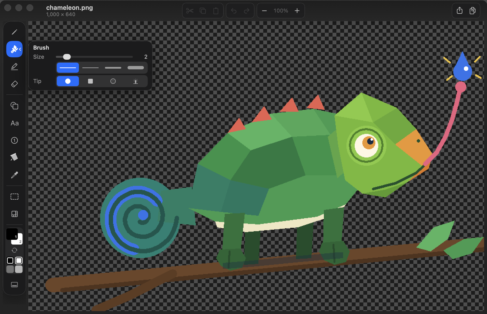
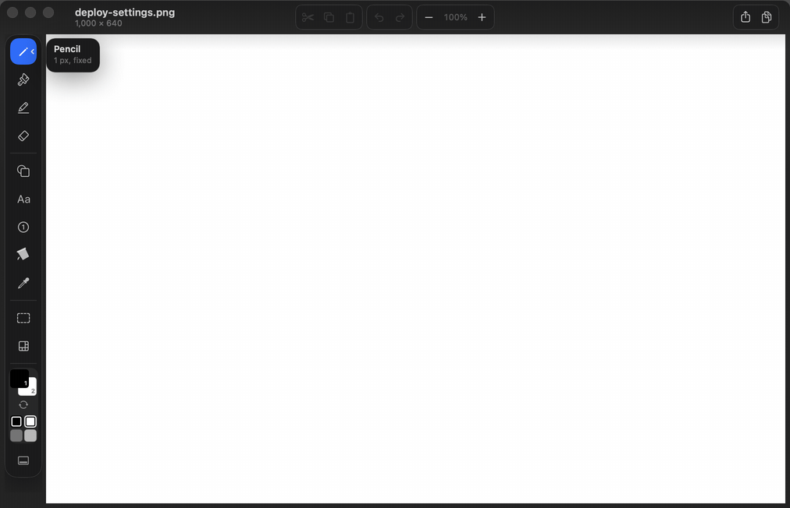
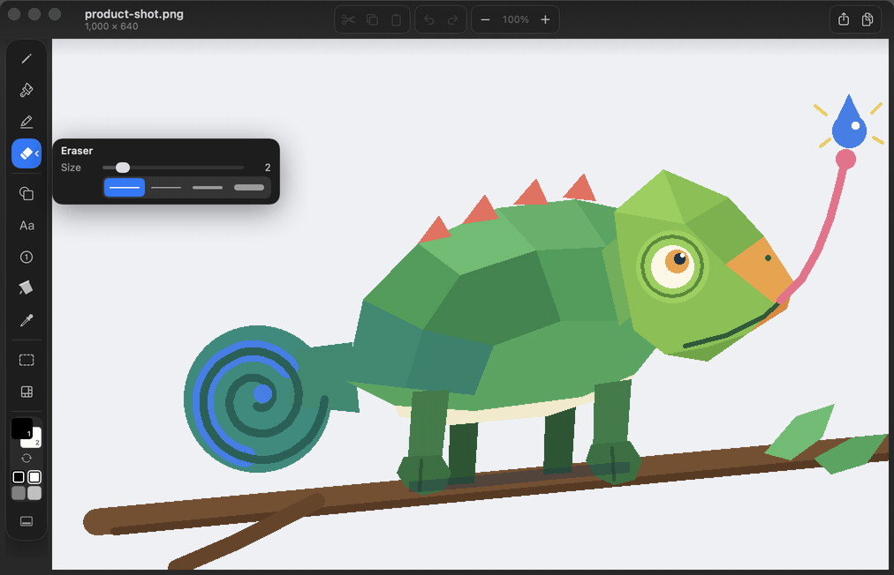

<div align="center">

# ItsPaint

### MS Paint for the Mac. Native, free, and under 3 MB.

A blank canvas at the size you asked for, an image dropped on top of another
one, a screenshot marked up and out the door. No workspace to set up, no
account, no subscription, no trial.

[](https://github.com/joshlin2201/itspaint/actions/workflows/ci.yml)
[](https://github.com/joshlin2201/itspaint/releases)
[](https://github.com/joshlin2201/itspaint/releases)
[](https://swift.org)
[](LICENSE)

<br>







<sub><b>Image ▸ Remove Background</b> — one command, no model, no network, and it declines rather than guessing when the page is not separable.</sub>

</div>

## The Mac never shipped a Paint, and the usual answers each miss something

Preview cannot make a blank canvas. Paintbrush has not kept up with macOS. The
capable editors are a gigabyte and cost money, and several of the free ones turn
out to be a trial. So here is the list people actually write out in those
threads, and what each one is in ItsPaint:

| What people ask for | How it works here |
|---|---|
| A blank canvas at the size I choose | `⌘N`, then `Image ▸ Canvas size…` for exact pixels. Set the size you usually want in Settings and `⌘N` is already right |
| Drop an image on top of another image | Drag it in from the Finder or paste with `⌘V`. A dropped image lands centred on the pointer |
| Move and scale it before it sticks | It arrives floating: drag the image, or drag its corner handles |
| Don't crop it when it's bigger than the canvas | The canvas grows to hold it and the window follows |
| Crop | Drag a selection, then `⌘K` |
| Zoom out far enough to see all of it | `⌘9` fits it to the window, and it goes well below 100% |
| A colour picked off the image, as hex | Eyedropper, or `⌥` from any tool. Every swatch shows its hex |
| Show up in right-click ▸ Open With | Registered as an editor for PNG, JPEG, TIFF, BMP, GIF and HEIC |
| Mark up a screenshot properly | Auto-numbered step badges, arrows, highlighter, and pixelate for anything you'd rather not publish |
| Be free, and stay free | MIT, no account, no telemetry, no trial, no upsell |

## Install

```bash
brew install --cask joshlin2201/itspaint/itspaint
```

Or get it free on the [Mac App Store](https://apps.apple.com/us/app/itspaint/id6796493980?mt=12),
or download the disk image from [Releases](https://github.com/joshlin2201/itspaint/releases),
open it, and drag **ItsPaint** to Applications.

Releases are signed with a Developer ID and notarised by Apple, so Gatekeeper
opens them with no extra steps — no Control-click, and nothing to clear from the
Terminal.

Each release includes `checksums.txt` with SHA-256 hashes. The notarisation
ticket is stapled to both the disk image and the app inside it, so a first
launch works offline:

```bash
shasum -a 256 -c checksums.txt
xcrun stapler validate ItsPaint-0.12.0.dmg
```

ItsPaint requires macOS 14 Sonoma or later.

To build from source:

```bash
git clone https://github.com/joshlin2201/itspaint.git
cd itspaint
open ItsPaint.xcodeproj
```

Build and run the **ItsPaint** scheme with `⌘R`. Xcode 16 or later is required.

## Highlights

- **Twelve visible tools** for drawing, markup, text, selection, colour, and
  pixelation.
- **Fifteen shapes** with solid, dashed, or dotted outlines and optional fills.
- **A 48pt tool rail** — one cell thick on either edge — that moves between the
  left and bottom of the window.
- **Precise canvas control** with pointer-centred zoom, nearest-neighbour display
  above 100%, pixel grids, and live tool footprints.
- **Rotate by any angle**, with the canvas growing to fit the corners.
- **Universal and notarised** — one build for Apple silicon and Intel, signed
  with a Developer ID, so it opens with no Gatekeeper detour.
- **Native documents and common exports** with no third-party dependencies,
  accounts, telemetry, or cloud service — and [three commands](#no-network-and-how-to-check)
  that check it.

## Tools

| Group | Tools |
|---|---|
| **Draw** | Pencil, Brush (round / square / soft / spray), Highlighter, Eraser |
| **Insert** | Shape, Text, Step Badge, Fill, Eyedropper |
| **Select** | Rectangle, Ellipse, Lasso, Instant Alpha |
| **Effects** | Pixelate |

The Shape tool includes line, curve, arrow, rectangle, rounded rectangle,
ellipse, triangle, right triangle, diamond, pentagon, hexagon, five- and
six-point stars, speech bubble, and polygon.

Instant Alpha selects connected pixels by colour. Use `⇧`-click to add to the
selection, `⌥`-click to subtract, then choose **Make transparent**.

Pixelate is intended for visual de-emphasis, not secure redaction. Use an opaque
filled shape to cover private information before exporting a flattened image.

## Everyday workflow

Paste an image with `⌘V` or open it from Finder. Add arrows, shapes, text, step
badges, highlights, or freehand marks. Floating pasted content and selections can
be moved or resized before they are placed. Export with `⇧⌘E`, or save an
editable `.itspaint` document.

| Shortcut | Action | Shortcut | Action |
|---|---|---|---|
| `P` | Pencil | `B` | Brush |
| `H` | Highlighter | `E` | Eraser |
| `U` | Shape | `T` | Text |
| `N` | Step Badge | `K` | Fill |
| `I` | Eyedropper | `M` | Select |
| `R` | Pixelate | | |
| `X` | Swap colours | `[` / `]` | Change tool size |
| `Space` | Pan | `⌥1`–`⌥9` | Choose a shape |

Pinch or `⌘`-scroll to zoom around the pointer. Hold `⌥` to sample a colour
without changing tools. Right-drag uses the second colour. `Esc` cancels the
current shape, text box, selection, floating paste, or options panel.

## Files and export

ItsPaint documents use the `.itspaint` package format: a lossless PNG with JSON
metadata for the canvas, colours, and palette.

Export supports PNG, JPEG, TIFF, BMP, GIF, HEIC, AVIF, PDF, and ICO when the
corresponding encoder is available in the installed macOS version. The export
panel includes format and scale controls. Formats without alpha are flattened
onto the second colour.

## No network, and how to check

ItsPaint never contacts anything. That is a claim, so here is how to falsify it.

The sandbox is the part that does not require trusting the source. Neither
`com.apple.security.network.client` nor `.server` is requested, so the kernel
refuses a socket regardless of what the code asks for:

```bash
codesign -d --entitlements - --xml /Applications/ItsPaint.app | plutil -p -
```

Three entitlements come back — the sandbox itself, read-write access to the
files chosen in an open or save panel, and app-scoped bookmarks so recent
documents reopen without re-prompting. Nothing else.

Nothing links against a networking framework, and nothing links outside the
system at all:

```bash
otool -L /Applications/ItsPaint.app/Contents/MacOS/ItsPaint
```

No `CFNetwork`, no `Network.framework`, no bundled dylib — every entry on both
architectures is an Apple framework or the Swift runtime.

In the source, across 5,838 lines of engine and 8,251 lines of app:

```bash
grep -rniE 'URLSession|NWConnection|import Network|CFSocket|getaddrinfo' App Packages
```

Zero matches. `Package.swift` declares no external dependency, so there is no
third-party code to audit behind that.

None of this is a promise about future versions. It is three commands that run
against the build you have.

## Design and implementation

ItsPaint has two layers:

```text
Packages/PaintKit/   UI-free drawing engine, raster operations, undo, and codecs
App/                 AppKit document lifecycle, canvas, and SwiftUI interface
```

PaintKit stores pixels as premultiplied RGBA8 and returns the changed rectangle
from every edit. The canvas redraws only that area, and undo history is bounded
by memory rather than by a fixed number of steps.

Run the test suites with:

```bash
swift test --package-path Packages/PaintKit
swift test -c release --package-path Packages/PaintKit
xcodebuild -project ItsPaint.xcodeproj -scheme ItsPaint \
  -destination 'platform=macOS' test
```

## Release notes

ItsPaint is in public beta. Released builds are signed with a Developer ID and
notarised. Text becomes pixels when committed, and WebP export is not available
because macOS does not provide a WebP encoder.

See [CHANGELOG.md](CHANGELOG.md) for version history and
[docs/README.md](docs/README.md) for the design, architecture, feature reference,
testing guide, and roadmap.

## Contributing

Issues and pull requests are welcome. [CONTRIBUTING.md](CONTRIBUTING.md) explains
the project structure, design constraints, and test requirements.

<div align="center">

[MIT License](LICENSE) · Built by [Josh Lin](https://github.com/joshlin2201)

</div>
