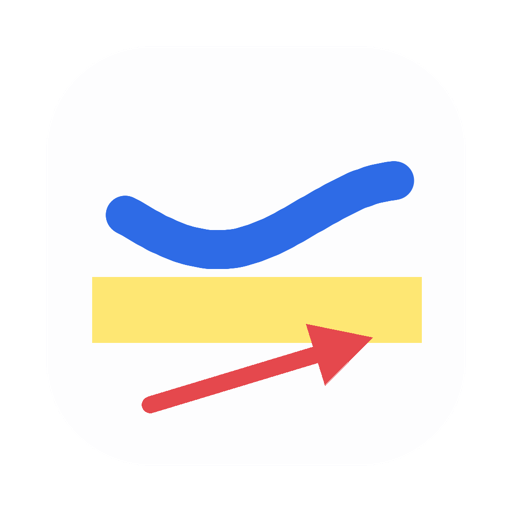

<div align="center">

<picture>
  <source media="(prefers-color-scheme: dark)" srcset="docs/images/icon.png">
  <source media="(prefers-color-scheme: light)" srcset="docs/images/icon-light.png">
  
</picture>

# ItsPaint

### MS Paint for the Mac. Paste a screenshot, number the steps, drag it into Slack.

Preview markup has no step badges, no pixelate and no drag-out.

**2.96 MB** · free on the App Store · MIT ·
**no network entitlement, so the kernel refuses a socket**

[](https://github.com/joshlin2201/itspaint/releases)
[](https://apps.apple.com/us/app/itspaint/id6796493980?mt=12)
[](LICENSE)
[](https://github.com/joshlin2201/itspaint/actions/workflows/ci.yml)

```sh
brew install --cask joshlin2201/itspaint/itspaint
```

**[Download the disk image](https://github.com/joshlin2201/itspaint/releases/latest)** · **[Mac App Store](https://apps.apple.com/us/app/itspaint/id6796493980?mt=12)** · macOS 14+, universal


</div>

## What makes it different

- **2.96 MB, and a window on screen in half a second.** Krita is a gigabyte and
  built for painters. CleanShot X is $29 plus a cloud subscription. Preview is
  already on your Mac and will not number a step or pixelate a token.
- **No network entitlement.** `com.apple.security.network.client` is not requested,
  so the kernel will not open a socket for it.
  [Three commands to check that yourself](#no-network-three-commands-to-prove-it).
- **Background removal with no ML model** and nothing to download. Four
  corner-seeded flood selections, unioned.
  [Thirty lines of code](docs/BACKGROUND_REMOVAL.md).
- **The drawing engine has no UI.** `Packages/PaintKit` imports Foundation,
  CoreGraphics, ImageIO, CoreText and UniformTypeIdentifiers, and nothing else, so
  `swift test` verifies most changes with no Xcode.
- **Free, MIT, and it stays that way.** There is no account and no telemetry.

Paste the screenshot, number the steps, crop it, drag it into Slack, close the
window. Nothing lands on your Desktop.

## What it does

### Mark up a screenshot and drag it out

- **Auto-numbered step badges, arrows, a highlighter with its own ink, and
  pixelate** for what you would rather not publish. Preview markup does none of it.
- **Drag the image straight out** into Slack, Mail or the Finder. No save panel, and
  no `Screenshot 2026-08-07 at 11.42.13.png` on your Desktop.
- **Spotlight the part that matters.** Drag a box and everything outside it dims, so
  the eye lands where you meant it to on a busy screenshot.
- **Paste anything on top of anything.** It arrives floating, and if it is bigger
  than the canvas the canvas grows instead of cropping it.
- **Annotation text stays readable** on any screenshot. It carries a contrasting
  rim, because one colour cannot work across a light panel and a dark one.

### Remove a background with no model and no network

<div align="center">


</div>

One command. It floods from all four corners and makes the union transparent. If the
page is not actually separable it says so and changes nothing.

It knows what a page is, not what a subject is, so it works on logos, product shots
and scanned diagrams. It is useless on hair.

**[How it works, in thirty lines of code →](docs/BACKGROUND_REMOVAL.md)**

### And it is still a paint app

- **Snap to grid** (`⇧⌘'`) at 8–64px for shapes, selections and pasted content.
  Freehand ignores it.
- **Fifteen shapes**, four brush nibs and four ways to select, each folded behind
  one rail button rather than sprawling across the window. `A` draws an arrow.
- **Pixel control.** Pointer-centred zoom, nearest-neighbour above 100%, a
  pixel grid, live tool footprints, and rotate by any angle.

<div align="center">


**Twelve tools, fifteen shapes, and a transparent canvas.**
The window above is ItsPaint painting, not marking up.

</div>

## Install

```bash
brew install --cask joshlin2201/itspaint/itspaint
```

Or take the [disk image](https://github.com/joshlin2201/itspaint/releases), open it
and drag **ItsPaint** to Applications. It is also free on the
[Mac App Store](https://apps.apple.com/us/app/itspaint/id6796493980?mt=12).

It ships often while it is in beta. **Watch ▸ Custom ▸ Releases** is the quietest way
to hear about a new build.

| | |
|---|---|
| **Requires** | macOS 14 Sonoma or later |
| **Architecture** | universal, one build for Apple silicon and Intel |
| **Signing** | Developer ID, notarised, ticket stapled to the image *and* the app, so the check needs no network and there is nothing to clear from the Terminal |
| **Download** | 2.96 MB for the disk image, with a SHA-256 in `checksums.txt` |

```bash
shasum -a 256 -c checksums.txt
xcrun stapler validate ItsPaint-*.dmg
```

If macOS asks you to confirm the first launch, open **System Settings ▸ Privacy &
Security** and click **Open Anyway**. [Why that happens](#first-launch).

## No network. Three commands to prove it

This is a property the kernel enforces, not a promise anyone is making. The first
two commands run against the copy in `/Applications`, the third greps this
repository:

```bash
codesign -d --entitlements - --xml /Applications/ItsPaint.app | plutil -p -
otool -L /Applications/ItsPaint.app/Contents/MacOS/ItsPaint
grep -rniE 'URLSession|NWConnection|import Network|CFSocket' App Packages
```

| Command | What comes back |
|---|---|
| `codesign` | Three entitlements: sandbox, files you pick in a panel, app-scoped bookmarks. No `network.client` and no `.server`, so the kernel will not open a socket for it |
| `otool` | Apple frameworks and the Swift runtime, on both architectures. No `CFNetwork`, no `Network.framework`, no bundled dylib |
| `grep` | Nothing. `Package.swift` also declares no dependency, so there is no third-party code behind it |

The entitlements check goes first because it is the one that holds even if the
developer is lying to you. It reports what the kernel will permit.

**[Why that order, and how to make the same claim falsifiable in your own app →](docs/PROVING_NO_NETWORK.md)**

## Contributing, and the engine needs no Xcode

`Packages/PaintKit` is a **UI-free Swift package**. No AppKit, no SwiftUI, no
third-party dependency. It imports Foundation, CoreGraphics, ImageIO, CoreText and
UniformTypeIdentifiers, and nothing else.

So most changes to how ItsPaint *draws* can be made and checked with a text editor
and a terminal. No simulator, no GUI session, no Xcode project:

```bash
git clone https://github.com/joshlin2201/itspaint.git
cd itspaint
swift test          # the whole engine suite, in a fresh clone
```

**Seven issues are open and labelled [`good first issue`](https://github.com/joshlin2201/itspaint/issues?q=is%3Aissue+is%3Aopen+label%3A%22good+first+issue%22)**,
each naming the file and the line to start at. They sit in three different parts of
the app so you can pick whichever suits you:

*View layer, AppKit drawing, no engine knowledge needed*
- [**#11** A loupe that follows the pointer](https://github.com/joshlin2201/itspaint/issues/11)

*Engine, pure functions over pixels, no Xcode needed*
- [**#12** Brightness, contrast and saturation](https://github.com/joshlin2201/itspaint/issues/12)
- [**#5** Arrowheads as a line style, not a separate shape](https://github.com/joshlin2201/itspaint/issues/5)

*Selection arithmetic, also engine-only*
- [**#3** Grow and shrink a selection by a pixel amount](https://github.com/joshlin2201/itspaint/issues/3)
- [**#4** Make a selection from the alpha channel](https://github.com/joshlin2201/itspaint/issues/4)
- [**#6** Flip and rotate the selection, not the whole image](https://github.com/joshlin2201/itspaint/issues/6)
- [**#7** Add to and subtract from a selection](https://github.com/joshlin2201/itspaint/issues/7)

The engine is also a dependency you can use without the app:

```swift
.package(url: "https://github.com/joshlin2201/itspaint", from: "0.15.0")
```

That gets you a product shot off its page in four lines, on device, with no model and
no network:

```swift
import PaintKit

let engine = PaintEngine(canvas: try ImageCodec.decode(contentsOf: input))
guard engine.removeBackground() else { fatalError("no background to remove") }
try ImageCodec.encode(engine.canvas, as: .png).write(to: output)
```

Those four lines are compiled and run against the published tag, and checked by
counting transparent pixels rather than by whether the program exited quietly. On a
60px mark centred on a 400×400 page the count goes from 0 to 156,400, which is
160,000 minus the 3,600 pixels of subject.

[CONTRIBUTING.md](CONTRIBUTING.md) covers the structure, the design constraints, and
what a change has to prove before it lands.

<br>

<details>
<summary><b>Tools and shortcuts</b></summary>

<br>

| Group | Tools |
|---|---|
| **Draw** | Pencil, Brush (round / square / soft / spray), Highlighter (own ink, four colours), Eraser |
| **Insert** | Shape, Text, Step Badge, Fill, Eyedropper |
| **Select** | Rectangle, Ellipse, Lasso, Instant Alpha |
| **Effects** | Pixelate, Spotlight |

Twelve rail buttons. Variations live inside the tool that owns them, so there are fifteen
shapes behind Shape, four nibs behind Brush and four modes behind Select. The whole
set stays available without a button each.

| Shortcut | Action | Shortcut | Action |
|---|---|---|---|
| `P` | Pencil | `B` | Brush |
| `H` | Highlighter | `E` | Eraser |
| `U` | Shape | `T` | Text |
| `N` | Step Badge | `K` | Fill |
| `I` | Eyedropper | `M` | Select |
| `R` | Pixelate | `S` | Spotlight |
| `X` | Swap colours | `[` / `]` | Change tool size |
| `Space` | Pan | `Esc` | Cancel what you are doing |
| `⌥1`–`⌥9` | Choose a shape | `⇧⌘'` | Snap to grid |
| `⌘K` | Crop to selection | `⌘9` | Fit to window |
| `⇧⌘E` | Export | `⌘V` | Paste as a floating image |

Pinch or `⌘`-scroll to zoom around the pointer. Hold `⌥` to sample a colour without
changing tools. Right-drag uses the second colour. `Esc` cancels the current shape,
text box, selection, floating paste, or options panel.

Instant Alpha selects connected pixels by colour. `⇧`-click adds, `⌥`-click
subtracts, then **Make transparent**.

Pixelate is for visual de-emphasis and not for secure redaction. Cover private
information with an opaque filled shape before you export a flattened image.

</details>

<details>
<summary><b>Files and export</b></summary>

<br>

ItsPaint documents use the `.itspaint` package format, which is a lossless PNG with
JSON metadata for the canvas, colours and palette.

Export supports PNG, JPEG, TIFF, BMP, GIF, HEIC, AVIF, PDF and ICO, when the
corresponding encoder ships with the installed macOS version. The export panel has
format and scale controls, and formats without alpha are flattened onto the second
colour.

ItsPaint registers as an editor for PNG, JPEG, TIFF, BMP, GIF and HEIC, so it appears
under right-click ▸ **Open With**.

WebP export is not available, because macOS does not provide a WebP encoder. Text
becomes pixels once it is committed.

</details>

<details>
<summary><b>How it is built</b></summary>

<br>

```text
Packages/PaintKit/   UI-free drawing engine, raster operations, undo, and codecs
App/                 AppKit document lifecycle, canvas, and SwiftUI interface
```

PaintKit stores pixels as premultiplied RGBA8 and returns the changed rectangle from
every edit. The canvas redraws only that area, and undo history is bounded by memory
rather than by a fixed number of steps.

[**Background removal without a model**](docs/BACKGROUND_REMOVAL.md) is a worked
example of both layers. Four corner-seeded flood selections unioned through the same
combiner `⇧`-click uses, and a guard that declines rather than returning a nearly
blank canvas.

That guard was also wrong for three releases, in a way worth reading about:
**[a guard tuned to its test →](docs/A_GUARD_TUNED_TO_ITS_TEST.md)**

PaintKit is a product of the root package, so it can be a dependency of anything that
wants a raster canvas without an editor around it. The four-line example is in
**Contributing** above.

[docs/README.md](docs/README.md) has the design notes, architecture, feature
reference, testing guide and roadmap. [CHANGELOG.md](CHANGELOG.md) has the version
history.

</details>

<a id="first-launch"></a>

<details>
<summary><b>First launch, and the Gatekeeper message</b></summary>

<br>

Open **System Settings ▸ Privacy & Security** and click **Open Anyway**.

This happened once, on macOS 26.6, with a freshly downloaded 0.12.0, on a disk image
that `spctl --assess` accepts and whose stapled ticket validates. It looks like a
first-launch check that went to Apple and did not come back. It is alarming enough
when it happens that it belongs here rather than in an issue.

Check the download yourself:

```bash
shasum -a 256 -c checksums.txt
codesign --verify --deep --strict --verbose=2 /Volumes/ItsPaint*/ItsPaint.app
spctl -a -vvv -t exec /Volumes/ItsPaint*/ItsPaint.app   # expect: accepted
```

</details>

<div align="center">

**If you installed it, a star is how the next person finds it from search.**

[MIT License](LICENSE) · Built by [Josh Lin](https://github.com/joshlin2201)

</div>
